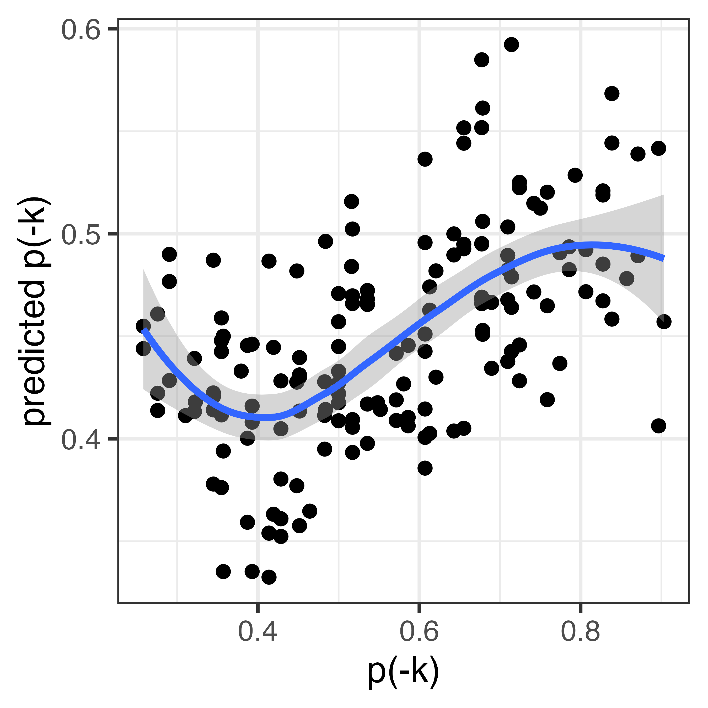

# JANET: Joint Alignment and Nonparametric Estimation Toolkit

A toolkit for computing phonologically-informed word similarity and predicting morphological variation.


[](https://doi.org/10.5281/zenodo.17980463)


## Quick start
```bash
julia run_janet.jl <feature_matrix.tsv> <word_list.tsv>
```

The script validates inputs, copies them to `source/`, and runs the full pipeline. Output is written to `out/`.

**Example using Hungarian data:**
```bash
julia run_janet.jl ex/siptar_torkenczy_toth_racz_hungarian.tsv ex/input.tsv
```

This produces:
- `out/segment_similarity.tsv` — pairwise segment similarities
- `out/aligned_word_pairs_phonological_distance.tsv.gz` — pairwise word distances

To fit kernel ridge regression on the output, see `script/krr.R`.

## Overview

This toolkit allows the user to estimate nonword behaviour based on the behaviour of similar existing words. We take a segmental feature matrix and use this to calculate similarity between segments using natural classes (Frisch, Pierrehumbert & Broe 2004). We then use this segmental similarity matrix to calculate similarity between words in a list (Dawdy-Hesterberg & Pierrehumbert 2014). The resulting phonological similarity will reflect the concept that "pat" is more similar to "bat" than to "hat", even though the Levenshtein distance is the same. We can then use the word similarity matrix to put nonwords into categories (classification) or predict how much they will do X (regression), based on the behaviour of existing words (Rácz, Beckner, Hay & Pierrehumbert 2020).

## Requirements

- Julia 1.12+
- Julia packages: `CSV`, `DataFrames`
- R 4.0+ (for KRR example only)
- R packages: `tidyverse` (for KRR example only)

## Installation

```bash
git clone https://github.com/petyaracz/JANET.git
cd JANET
```

Install Julia dependencies:

```julia
using Pkg
Pkg.add(["CSV", "DataFrames"])
```

## Quick start

```bash
# 1. Generate segment similarity matrix from features
julia script/generate_segmental_distances.jl

# 2. Align words and compute pairwise distances
julia script/phonological_distance_between_words.jl

# 3. (Optional) Fit kernel ridge regression
Rscript script/krr.R
```

Input files are in `source/`, output files are written to `out/`.

## Pipeline

1. Take segmental features
2. Create segment similarity table
3. Transcribe words into letter-to-sound alphabet and write them into an input file
4. Use distance table and word list to align words
5. Use distance table and outcome variable to fit kernel ridge regression

---

## Input/Output specifications

### Step 1: Generate segmental distances

#### Input: Segment feature matrix

A tab-separated file with the following structure:

| Requirement | Detail |
|-------------|--------|
| Format | TSV (tab-delimited) |
| Encoding | UTF-8 |
| Header row | Required |
| First column | Must be named `segment`; contains segment labels (phonemes) |
| Remaining columns | Feature names; values are binary (0 or 1) or empty (missing) |

**Segment column**

- Each row represents one segment in the phonological inventory
- Segment labels must be **single characters** (one Unicode codepoint, e.g., `a`, `ā`, `ʃ`, `N`)
- Labels must be unique
- Labels should match the transcription alphabet used in word forms

Note: If your orthography uses digraphs (e.g., `ng`, `th`, `ch`), you must map these to single characters (e.g., `ng` → `N`, `th` → `θ`) before using JANET. This letter-to-sound preprocessing is your responsibility.

**Feature columns**

- Column names are feature labels (e.g., `cons`, `voice`, `labial`)
- Cell values: `0`, `1`, or empty
- Empty cells are treated as "not applicable" — the segment will not match any feature specification involving that feature
- Features should be binary phonological features in the SPE or similar tradition

**Example**

```
segment	cons	son	voice	labial	coronal
p	1	0	0	1	0
b	1	0	1	1	0
t	1	0	0	0	1
a	0		1	0	0
```

Here, vowel `a` has no value for `son` (sonority is not contrastive for vowels in this analysis), so it will not be grouped into natural classes defined by sonority.

**Constraints**

- No duplicate segment labels
- No duplicate feature names
- At least one feature column required
- Segment labels must be single characters
- Segment labels should not contain tab characters

#### Output: Segment similarity matrix

A TSV file with pairwise similarity scores for all segments.

| Column | Type | Description |
|--------|------|-------------|
| `segment1` | string | First segment |
| `segment2` | string | Second segment |
| `similarity` | float | Similarity score between 0 and 1 |

**Properties**

- Contains all ordered pairs (segment1, segment2), including identical pairs
- Similarity of a segment with itself is 1.0
- Matrix is symmetric: similarity(a, b) = similarity(b, a)
- Includes gap rows: similarity of any segment with `" "` (space) is 1.0

**Similarity metric**

Similarity is calculated using natural classes:

```
similarity = shared_classes / (shared_classes + non_shared_classes)
```

Where:
- `shared_classes`: number of natural classes containing both segments
- `non_shared_classes`: number of natural classes containing exactly one segment

**Example**

```
segment1	segment2	similarity
p	p	1.0
p	b	0.714
p	t	0.5
p	a	0.125
a	 	1.0
```

---

### Step 2: Phonological distance between words

#### Input: Word list

A tab-separated file containing words to align.

| Requirement | Detail |
|-------------|--------|
| Format | TSV (tab-delimited) |
| Encoding | UTF-8 |
| Header row | Required |
| Required column | `lemma` |

**Lemma column**

- Each row is one word form
- Words must be transcribed in the same alphabet as the segment feature matrix
- Each character in a word must exist in the segment similarity matrix
- Duplicates are automatically removed

**Example**

```
lemma
pata
bada
kata
apa
```

#### Input: Segment distance matrix

The output of the segment similarity script. The aligner reads similarity and converts internally: `distance = 1 - similarity`.

#### Output: Word distance matrix

A tab-separated file containing pairwise phonological distances between all words.

| Column | Type | Description |
|--------|------|-------------|
| `word1` | string | First word |
| `word2` | string | Second word |
| `phon_dist` | float | Total alignment distance |

**Properties**

- Matrix is symmetric: includes both (word1, word2) and (word2, word1)
- Self-distances included: distance(word, word) = 0
- Total rows: n² for n unique words
- Output is gzip-compressed

**Distance metric**

Phonological distance is computed via Needleman-Wunsch alignment:

- Substitution cost: segment distance from similarity matrix
- Gap penalty: 1.0 (insertion or deletion)
- Total distance: sum of costs along optimal alignment path

**Example**

```
word1	word2	phon_dist
pata	bada	0.572
bada	pata	0.572
pata	pata	0.0
```

**Parameters**

| Parameter | Default | Description |
|-----------|---------|-------------|
| Gap penalty | 1.0 | Cost of inserting or deleting a segment |

Currently hardcoded. A segment pair not found in the distance matrix defaults to distance 1.0.

---

### Step 3: Kernel ridge regression (example)

The `krr.R` script demonstrates how to use the word distance matrix to predict morphological behaviour. This is provided as an example; users may prefer other methods (SVM, nearest-neighbour classification, etc.).

---

## Example: Hungarian -ik variation

The repo includes a worked example using Hungarian verbal morphology. Some Hungarian verbs vary between -k/-m in 1sg.indef (for details, see Rácz & Lukács 2024). The example:

- `source/siptar_torkenczy_toth_racz_hungarian.tsv`: Segmental feature matrix for Hungarian
- `source/forms.tsv`: Word list for aligner
- `script/krr.R`: Kernel ridge regression predicting participant choices in a forced-choice task based on webcorpus frequencies

The results show that similarity to existing words (that have varying rates of -k/-m preference) predicts nonword preference for -k/-m (Conditional R2: 0.567 (95% CI [0.501, 0.627])). In reality, this is likely weighted by real word frequency, but similarity to types is a useful first approximation. 



---

## Citation

If you use JANET in your research, please cite:

https://doi.org/10.5281/zenodo.17980463

```bibtex
@software{racz_janet_2025,
  author = {Rácz, Péter},
  title = {JANET: Joint Alignment and Nonparametric Estimation Toolkit},
  year = {2025},
  url = {https://github.com/petyaracz/JANET}
}
```

---

## Authors

Péter Rácz

---

## License

MIT License. See [LICENSE](LICENSE) for details.

---

## References

Albright, Adam, and Bruce Hayes. "Rules vs. analogy in English past tenses: A computational/experimental study." Cognition 90, no. 2 (2003): 119-161.

Frisch, Stefan A., Janet B. Pierrehumbert, and Michael B. Broe. "Similarity avoidance and the OCP." *Natural Language & Linguistic Theory* 22, no. 1 (2004): 179-228.

Dawdy-Hesterberg, Lisa Garnand, and Janet Breckenridge Pierrehumbert. "Learnability and generalisation of Arabic broken plural nouns." *Language, Cognition and Neuroscience* 29, no. 10 (2014): 1268-1282.

Siptár, Péter, and Miklós Törkenczy. The phonology of Hungarian. OUP Oxford, 2000.

Rácz, Péter, Clay Beckner, Jennifer B. Hay, and Janet B. Pierrehumbert. "Morphological convergence as on-line lexical analogy." *Language* 96, no. 4 (2020): 735-770.

Rácz, Péter, and Ágnes Lukács. "Variation in the 1sg. indef: More than you wanted to know." *Acta Linguistica Academica* 71, no. 1-2 (2024): 2-17.
